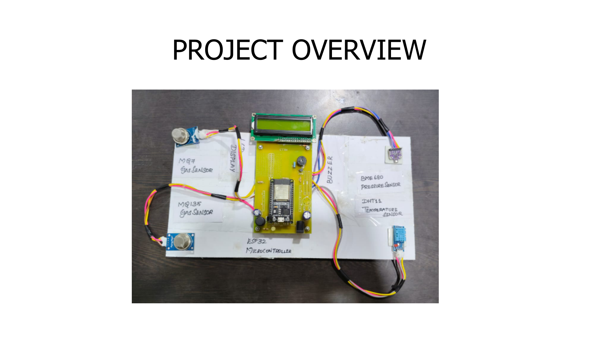
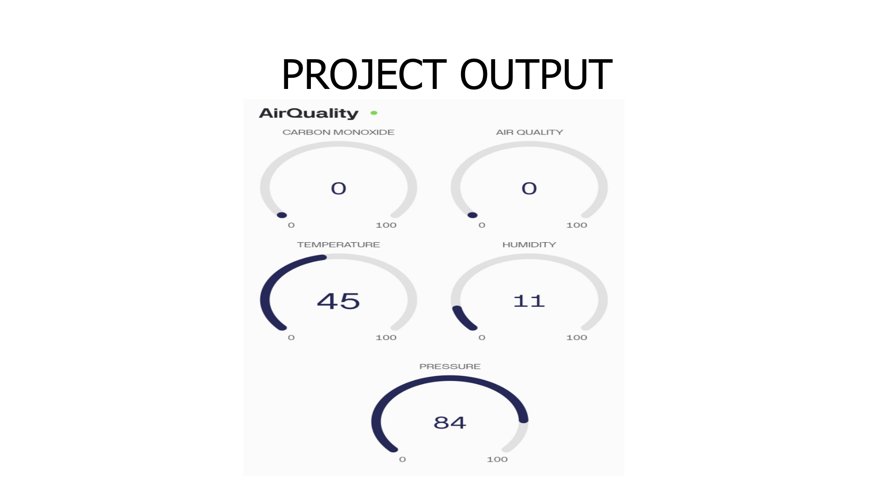
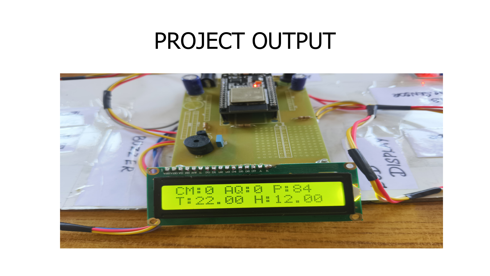

# ESP32 Air Quality Monitoring System

## Overview
An ESP32-based IoT environmental monitoring system developed for real-time air quality monitoring using MQ7, MQ135, BME680, and DHT11 sensors.

## Features
- Real-time gas monitoring
- Temperature and humidity monitoring
- Wi-Fi-based cloud monitoring using Blynk
- LCD display output
- Buzzer alert system

## Hardware Used
- ESP32
- MQ7 Sensor
- MQ135 Sensor
- BME680
- DHT11
- 16x2 LCD

## Software Used
- Arduino IDE
- Blynk IoT Platform

---

# Hardware Setup

---

# LCD Output

---

# Blynk Dashboard

